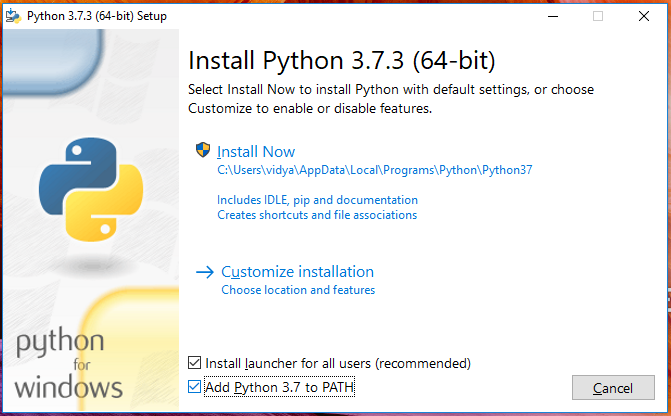

# Install Python

> Sections of this workshop were taken from the excellent [Django Girls Tutorial](https://tutorial.djangogirls.org/en/),
> a more comprehensive tutorial that we encourage you to try in your own time.

In this workshop we will be using Python 3.6 or later and the PyCharm editor. If you already have
Python 3.6 or later installed, jump to the [PyCharm installation section](#installing-pycharm).

## Install Python: Windows

1. Go to [https://www.python.org/downloads/windows/](https://www.python.org/downloads/windows/)
2. Click on the **Latest Python 3 Release - Python x.x.x** link
3. Scroll down to the **Files** section
4. Download the **Windows x86-64 executable installer**
5. Execute the installer and follow the promps. When you get to the **Setup** screen make sure you
   tick the **Add Python 3.7 to PATH** checkbox.


6. To check if the installation was successful, launch a terminal (hit **Command + R**, 
type in `cmd` and hit Enter) and then enter the following command into your terminal:

```bash
python --version
```
This should output Python 3.7.3

## Install Python: macOS

Check if you already have Python 3 installed by launching a terminal (hit **Command + Space**,
type in `terminal` and hit Enter) and then entering the following command into your terminal:

```bash
python3 --version
```

If the command outputs Python 3.6 or later, continue to the
[PyCharm installation section](#installing-pycharm).

If you don't have Python installed, or if you want a newer version, follow the instructions at
[https://brew.sh/](https://brew.sh/) to install the Homebrew package manager and then run:

```bash
brew install python3
```

## Install Python: Linux

It is very likely that you already have Python installed out of the box. To check if you have it
installed (and which version it is), open a console and type the following command:

```bash
python3 --version
```

If the command outputs Python 3.6 or later, continue to the
[PyCharm installation section](#installing-pycharm). Otherwise install Python with your operating
system's package manager:

### Debian or Ubuntu

Open a terminal and run:

```bash
sudo apt-get update
sudo apt-get install python3 python3-pip
```

### Fedora

Open a terminal and run:

```bash
sudo dnf install python3
```

### CentOS

```bash
sudo yum install epel-release
sudo yum install python36 python36-pip
```

## Installing PyCharm

To install PyCharm visit [https://www.jetbrains.com/pycharm/](https://www.jetbrains.com/pycharm/)
and click **Download Now**. The Community edition is free and has all the features you will need for
this workshop.
